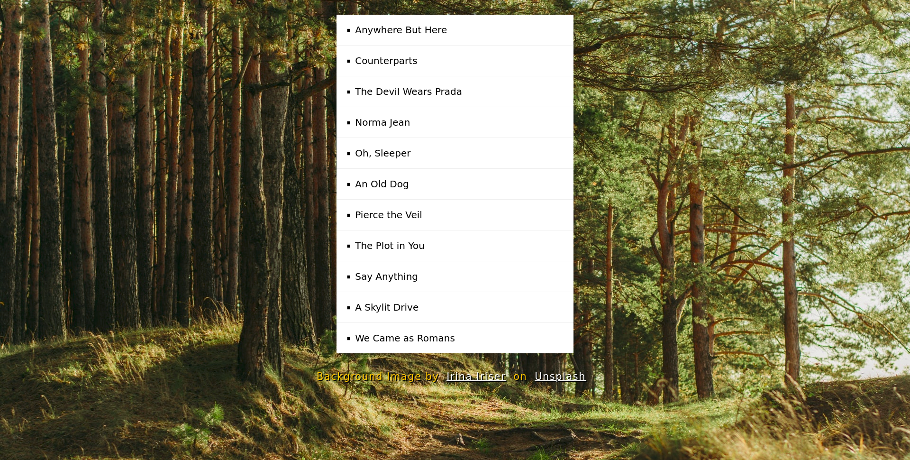

# 17-Sort-Without-Articles

Date: July 19, 2022

# Seventeenth challange of [JavaScript30](https://javascript30.com/)

. To experience on your own visit [here](https://rohit-saini7.github.io/17-Sort-Without-Articles/).

## What is JavaScript 30

JavaScript 30 is a course taught by Wes Bos. With over 500,000 students, JavaScript 30 is build on the premise that you'll build 30 projects in 30 days. You do need to have an understanding of JavaScript before taking on JavaScript 30.

Learn more about the course in [here](https://javascript30.com/).

## Screenshot

## Background

Image by [Irina Iriser](https://unsplash.com/@iriser) on [Unsplash](https://unsplash.com/s/photos/forest-wallpaper)
